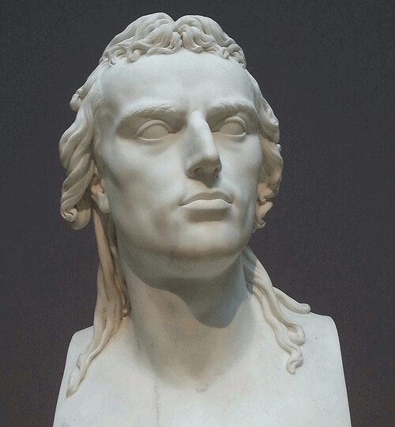

# tiny_schiller

Inspired by tiny_shakespeare, this brings you all the works from the, as a matter of course, best German poet and writer - Friedrich Schiller, to your language models.

*"Einfachheit ist das Resultat der Reife." - Friedrich Schiller*



49483 lines or 319649 words or 1685792 characters (excluding spaces) or 1991325 characters (including spaces) of Friedrich Schiller.
The document comprises of the following works, originally from [Projekt Gutenberg](https://www.projekt-gutenberg.org/autoren/namen/schiller.html).

## Dramen und begleitende Schriften:
- Briefe über Don Carlos
- Aus dem Szenar zum »Demetrius«
- Demetrius
- Die Huldigung der Künste
- Die Jungfrau von Orleans
- Die Räuber
- Die Verschwörung des Fiesco zu Genua
- Don Carlos, Infant von Spanien
- Kabale und Liebe
- Maria Stuart
- Wallenstein
- Wilhelm Tell


## Citation

If you use this work in your research or projects, please cite it as follows:

```markdown
@misc{
  author={Schutera, Mark},
  title={tiny_schiller},
  year={2023},
  howpublished={\url{https://github.com/schutera/tiny_schiller/blob/main/tiny_schiller.txt}}
}
